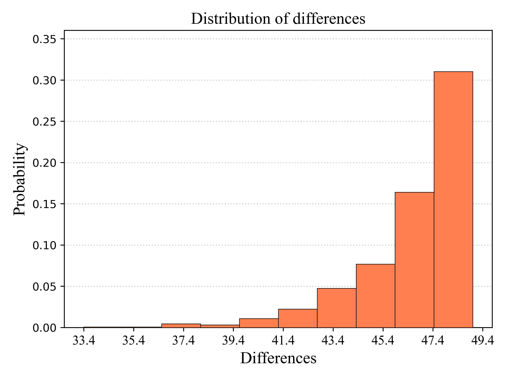
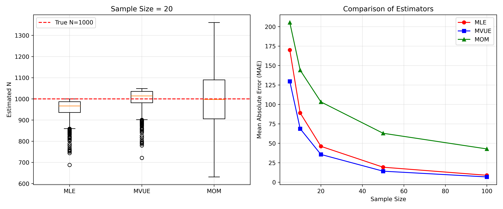

# German Tank Problem: Statistical Comparison of Estimators

## Overview
This project simulates the WWII German Tank Problem to compare three estimators (MLE, MVUE, MOM) for estimating the total number of tanks N from serial numbers.

## Methods
- Monte Carlo simulation (1000 iterations)
- Comparison via Mean Absolute Error (MAE)
- Statistical tests: Shapiro-Wilk, Paired t-test, Wilcoxon signed-rank, Bootstrap CI

## Key Findings
- MVUE consistently outperforms MLE and MOM in terms of MAE.
- Wilcoxon test confirms MVUE is significantly better (p < 0.001).
- Bootstrap CI for median difference contains zero, indicating median difference is not significant.

## How to Run
1. Clone the repository
2. Install requirements: `pip install -r requirements.txt`
3. Run the Jupyter notebook: `jupyter notebook notebooks/german_tank_analysis.ipynb`
   Or run the Python script: `python src/german_tank_analysis.py`

## Results

### MAE Comparison Across Sample Sizes

### Distribution of Differences (K=20)

### Boxplot and Error Comparison

## Repository Structure
.
├── data/
│ └── mae_results.csv
├── notebooks/
│ └── german_tank_analysis.ipynb
├── reports/
│ └── figures/
│ ├── mae_comparison.png
│ ├── differences_distribution.png
│ └── box_errors.png
├── src/
│ └── german_tank_analysis.py
├── README.md
└── requirements.txt