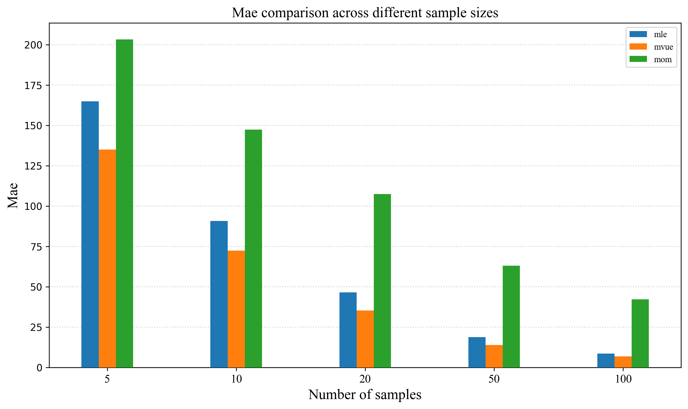
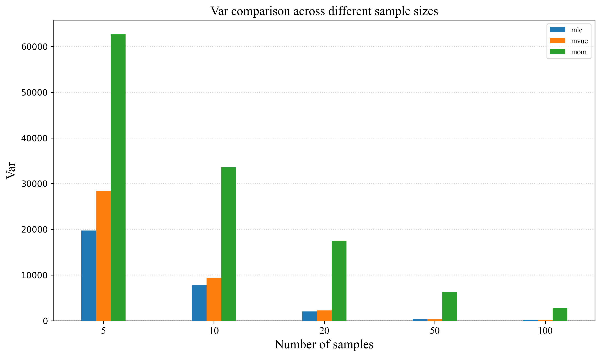
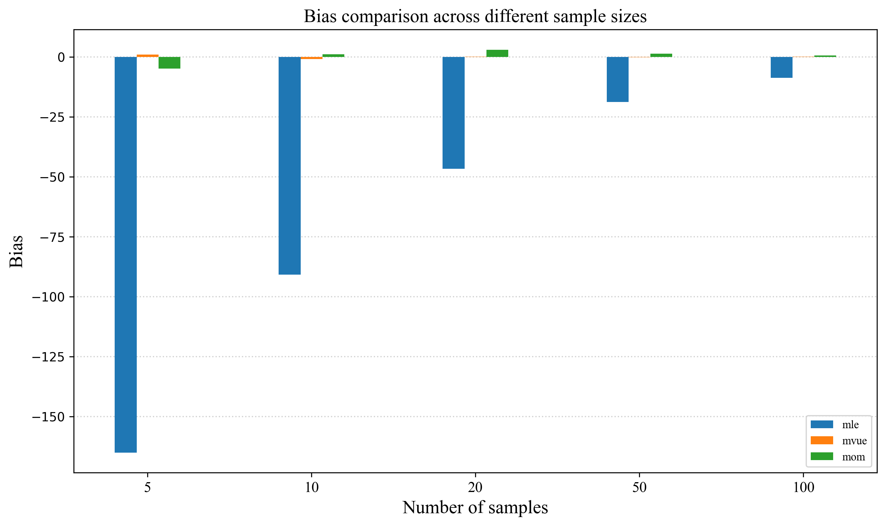
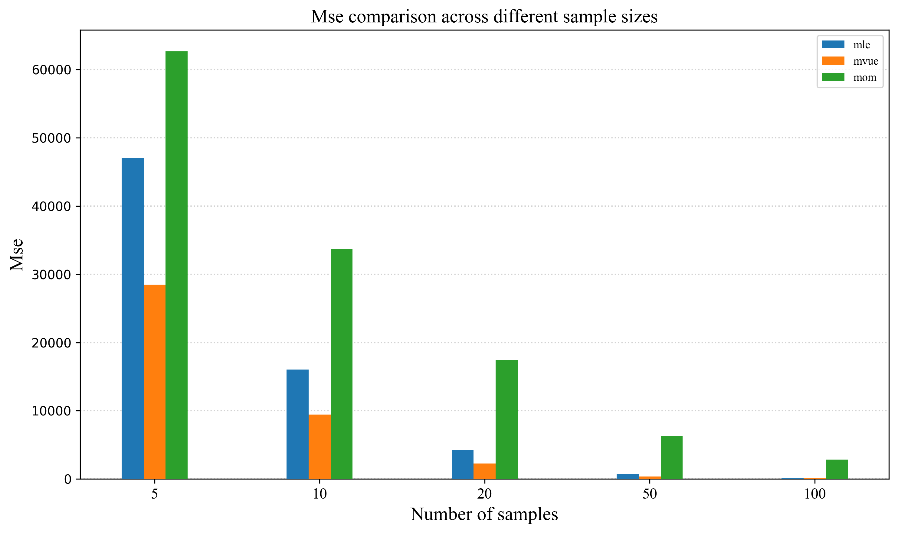

# German Tank Problem: Monte Carlo Simulation and Estimator Comparison

## Overview
This project simulates the WWII German Tank Problem and compares three estimators (MLE, MVUE, and MOM) for estimating the total number of tanks N from observed serial numbers.
Version 1.0 generates bar plots comparing estimator performance across different sample sizes.

## Problem Background
During World War II, the Allies were curious to estimate the total number of tanks produced by Germany. 
Conventional intelligence methods were highly unreliable. 
Statisticians, however, devised an inventive approach: 
they estimated the unknown population size $N$ using only the serial numbers of captured tanks. 
This problem, known as the $\textbf{German Tank Problem}$, demonstrates how statistical estimation can outperform traditional intelligence gathering.

## Methods
- Monte Carlo simulation (1000 iterations)

Let K denote the sample size.

### Estimators

$$\hat{N}_{\text{MLE}} = \max(X_1, \dots, X_K)$$

$$\hat{N}_{\text{MVUE}} = \max(X_1, \dots, X_K) \cdot \left(1 + \frac{1}{K}\right) - 1$$

$$\hat{N}_{\text{MOM}} = 2 \cdot \bar{X} - 1$$

-Compare the performance of the estimators using:
- Mean Absolute Error (MAE)
- Variance
- Bias
- Mean Squared Error (MSE)

## Project Structure
```
project/
│
├── src/
│   ├── main.py
│   ├── estimators.py
│   ├── simulation.py
│   ├── statistic.py
│   └── visualization.py
│
├── reports/
│   └── figures/
│
├── README.md
└── requirements.txt
```

## How to Run
1. Clone the repository
2. Install requirements: `pip install -r requirements.txt`
3. Run the Python script: `python src/main.py`
**Note: The generated figures will be saved in reports/figures.**

## Results

### MAE Comparison Across Sample Sizes


### Variance Comparison Across Sample Sizes


### Bias Comparison Across Sample Sizes


### MSE Comparison Across Sample Sizes


## Key Findings
- In the simulated experiments, MVUE exhibited lower bias than MLE and MOM.
- Estimation accuracy improved as the sample size increased.
- For larger sample sizes, estimator variance decreased substantially.
- MSE and MAE results were consistent with the observed bias and variance behavior.

## Future Improvements
- Add confidence intervals
- Add statistical hypothesis tests
- Add pytest unit tests
- Export results to CSV
- Add boxplot visualizations